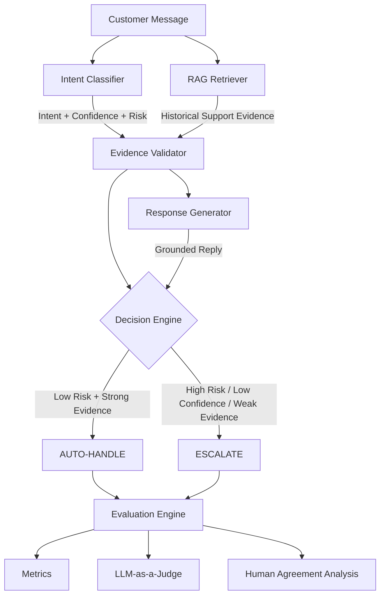

# AppleSupport AI Agent: Risk-Aware RAG & Automated Triage System

> An auditable customer-support AI system for Apple Support using intent classification, Retrieval-Augmented Generation (RAG), deterministic risk-gated triage, and multi-dimensional evaluation.

---

## 1. Problem & Approach

### Selected Brand: Apple Support (`@AppleSupport`)

This project uses the **Customer Support on Twitter (TWCS)** dataset and focuses on `AppleSupport` conversations.

The objective is to build an AI support agent that can:

1. Classify incoming customer messages into a small set of brand-specific intents.
2. Retrieve historically similar Apple Support conversations and their resolutions.
3. Generate a response grounded in the retrieved evidence.
4. Decide whether the response can be automatically handled or should be escalated to a human.
5. Evaluate the system using a manually labelled golden benchmark and automated evaluation.

### Problem Definition

Generative AI in customer support introduces two major risks:

1. **Unsupported or incorrect guidance**  
   The model may generate technical instructions that are not supported by the historical support data.

2. **Unsafe automated handling**  
   Security incidents, billing disputes, account compromise, and ambiguous cases should not be automatically resolved merely because an LLM is confident.

The system therefore follows a conservative principle:

> **Automate routine, low-risk, well-evidenced cases and escalate high-risk, ambiguous, or insufficiently supported cases.**

### What "Good Support" Means

For this project, good support is defined as:

- **Correct** — the response addresses the actual customer problem.
- **Grounded** — recommendations are supported by retrieved historical evidence.
- **Relevant** — the response directly addresses the customer's request.
- **Helpful** — the customer receives actionable next steps.
- **Brand-consistent** — the response follows a concise, professional support tone.
- **Safe** — high-risk cases are routed to human support instead of being automatically handled.

### What Is Intentionally Out of Scope

The project does not attempt to:

- Execute physical hardware repairs.
- Book appointments or process device replacements.
- Execute refunds or financial transactions.
- Access Apple ID credentials or authentication systems.
- Validate real customer identity.
- Handle arbitrary general-knowledge questions.
- Replace human agents for high-risk support cases.

---

# 2. Architecture



## Pipeline Components

### 1. Customer Ingestion

Accepts a customer message through the FastAPI application.

### 2. Intent Classification

Classifies the message into one of ten project-specific intents and produces:

- Intent
- Confidence
- Risk level

### 3. RAG Retrieval

Retrieves historically similar Apple Support conversations from the processed TWCS dataset.

### 4. Evidence Validation

Determines whether the retrieved historical evidence is sufficiently strong to support automated response generation.

### 5. Response Generation

Generates a response using the customer's message and retrieved historical resolutions.

### 6. Decision Engine

A deterministic rule-based engine decides:

```text
AUTO-HANDLE
or
ESCALATE
```

### 7. Evaluation Engine

Evaluates:

- Intent classification
- Retrieval quality
- Response quality
- Decision quality
- LLM-judge agreement with human evaluation

---

# 3. Dataset & Preparation

## Dataset Source

The project uses the **Customer Support on Twitter (TWCS)** dataset from Kaggle.

The dataset contains millions of customer-support tweets from multiple brands.

### Selected Brand

```text
AppleSupport
```

### Data Processing Pipeline

The raw Twitter data is transformed into customer-support interaction pairs.

Processing includes:

1. Removing support-account mentions and user handles.
2. Removing unnecessary URLs.
3. Normalizing HTML entities.
4. Normalizing whitespace and punctuation.
5. Filtering extremely short/uninformative messages.
6. Reconstructing customer → brand interactions using tweet IDs.

### Conversation Reconstruction

The raw tweets are converted into structured records such as:

```json
{
  "conversation_id": "115888",
  "customer_tweet_id": "115889",
  "brand_tweet_id": "115888",
  "customer_message": "My iPhone battery is draining so fast after the update.",
  "brand_response": "We'd like to help. Have you checked Settings > Battery?"
}
```

This representation allows the RAG system to retrieve both:

- the historical customer problem
- the historical brand resolution

### Retrieval Corpus

The processed AppleSupport conversations are indexed using TF-IDF.

```text
Historical AppleSupport conversations
            ↓
       Text cleaning
            ↓
   Customer/response pairs
            ↓
        TF-IDF index
```

The exact number of indexed records should be reported from the final preprocessing run.

---

# 4. Intent Taxonomy

The intent taxonomy was created specifically for AppleSupport conversations rather than using an external intent taxonomy.

| Intent | Risk | Description |
|---|---|---|
| `ios_update_issue` | LOW | Bugs, slowness, or issues after an iOS update |
| `battery_drain` | LOW | Abnormal battery depletion or charging issues |
| `app_crash` | LOW | Applications crashing or freezing |
| `wifi_connectivity` | LOW | Wi-Fi, Bluetooth, or network connectivity issues |
| `device_performance` | LOW | General device freezing, lag, or responsiveness issues |
| `account_access` | MEDIUM | Password, login, account-lockout, or authentication problems |
| `account_security` | HIGH | Unauthorized access, compromised accounts, or security incidents |
| `billing_payment` | HIGH | Unrecognized charges, subscriptions, payment issues, or refunds |
| `hardware_issue` | MEDIUM | Physical device damage or hardware problems |
| `general_question` | LOW | Feature, compatibility, or general product questions |

### Why These Intents?

The taxonomy was designed to balance:

- coverage of common support issues
- classification feasibility
- operational usefulness
- risk-aware escalation

The taxonomy is intentionally small enough to make classification measurable while preserving meaningful distinctions between support scenarios.

---

# 5. AI Support Pipeline

## 5.1 Intent Classification

The proposed classifier uses:

```text
Llama-3.3-70B
        +
Structured JSON output
```

The classifier receives the customer message and the available intent taxonomy.

Example:

```json
{
  "intent": "battery_drain",
  "confidence": 0.94,
  "reasoning": "The customer reports unusually rapid battery depletion."
}
```

The implementation also includes fallback parsing to prevent malformed model output from breaking the pipeline.

### Baseline

A TF-IDF + Logistic Regression classifier is implemented as the simple ML baseline.

---

# 5.2 RAG Retrieval

The retrieval system uses TF-IDF with:

- Unigrams
- Bigrams
- Sublinear TF scaling
- Cosine similarity

Pipeline:

```text
Customer message
      ↓
TF-IDF transformation
      ↓
Cosine similarity
      ↓
Rank historical conversations
      ↓
Top-K evidence
```

The retrieved records contain both the historical customer problem and the corresponding AppleSupport response.

### Retrieval Evidence

The system calculates evidence strength using the similarity of retrieved results.

The implementation uses a weighted combination of:

- maximum similarity
- average similarity

to produce a retrieval-confidence estimate.

---

# 5.3 Evidence Validation

Before automated handling, the system checks whether the retrieved evidence is sufficiently strong.

Evidence is categorized as:

```text
Strong
Moderate
Weak
```

The evidence validator prevents the response generator from treating weak retrieval matches as reliable support evidence.

---

# 5.4 Response Generation

The LLM receives:

```text
Customer message
+
Intent
+
Retrieved historical support evidence
```

The generation prompt instructs the model to:

- answer the customer's actual issue
- remain concise
- follow the support tone
- use retrieved evidence
- avoid unsupported technical instructions
- avoid claiming actions that were not performed

Example output:

```json
{
  "reply": "We'd be happy to help. Please check Settings > Battery to see which apps are using the most power.",
  "evidence_used": ["conversation_1234"],
  "confidence_note": "Response is supported by similar historical AppleSupport interactions."
}
```

---

# 5.5 Decision Engine

The final decision is made by a deterministic policy engine rather than allowing the LLM to make the safety-critical decision.

Conceptually:

```python
if risk == "HIGH":
    return "ESCALATE"

if intent_confidence < 0.60:
    return "ESCALATE"

if retrieval_confidence < 0.20:
    return "ESCALATE"

if risk == "MEDIUM" and not evidence_sufficient:
    return "ESCALATE"

return "AUTO-HANDLE"
```

### Decision Policy

| Condition | Decision |
|---|---|
| High-risk intent | ESCALATE |
| Low intent confidence | ESCALATE |
| Weak retrieval evidence | ESCALATE |
| Medium risk + insufficient evidence | ESCALATE |
| Low risk + sufficient confidence/evidence | AUTO-HANDLE |

The system prioritizes **safe escalation over maximizing automation rate**.

---

# 6. Evaluation Methodology

Evaluation is separated from the retrieval corpus to reduce leakage and provide an independent benchmark.

## 6.1 Golden Evaluation Set

The final golden evaluation set contains:

> **200 manually labelled examples**

The examples are sampled across all ten intents.

The benchmark is designed to contain:

- routine cases
- ambiguous cases
- compound cases
- high-risk cases
- low-evidence cases
- adversarial/edge cases

### Sampling Strategy

The 200 examples are stratified across:

- Intent categories
- Risk levels
- Difficulty levels

Target distribution:

```text
Easy       → 120 examples
Medium      → 60 examples
Hard        → 20 examples
-----------------------------
Total      → 200 examples
```

The final distribution may differ slightly if the available real examples do not support an exact allocation. The actual final distribution is reported with the benchmark.

### Manual Labelling

Each example contains ground-truth information such as:

```json
{
  "id": "gold_001",
  "message": "My payment was charged twice.",
  "intent": "billing_payment",
  "risk": "HIGH",
  "expected_decision": "ESCALATE"
}
```

The golden set is kept separate from the retrieval corpus wherever possible.

---

# 6.2 Leakage Prevention

Evaluation must not retrieve the exact historical record being evaluated.

During retrieval evaluation, the evaluated conversation ID is excluded from the candidate retrieval set.

This prevents the system from receiving the answer through exact record matching.

---

# 6.3 Intent Metrics

The intent classifier is evaluated using:

- Accuracy
- Macro Precision
- Macro Recall
- Macro F1
- Confusion Matrix
- Confidence calibration

Macro F1 is particularly important because it prevents frequent intents from completely dominating the evaluation.

---

# 6.4 Retrieval Metrics

The retrieval system is evaluated using:

- Recall@1
- Recall@3
- Recall@5
- Precision@K
- Mean Reciprocal Rank (MRR)
- Similarity distribution

Retrieval relevance is determined using manually defined relevance criteria for the evaluation benchmark.

---

# 6.5 Decision/Triage Metrics

The decision engine is evaluated using:

- Decision Accuracy
- Escalation Precision
- Escalation Recall
- Decision F1
- False Auto-Handle Rate

### Primary Safety Metric

The most important safety metric is:

> **False Auto-Handle Rate**

A false auto-handle occurs when the system automatically handles a case that should have been escalated.

This is treated as more serious than unnecessarily escalating a routine case.

---

# 6.6 Response Quality

Generated responses are evaluated using a six-dimensional LLM-as-a-Judge rubric.

| Dimension | Weight |
|---|---:|
| Correctness | 25% |
| Groundedness | 20% |
| Relevance | 20% |
| Helpfulness | 20% |
| Brand Consistency | 10% |
| Safety | 5% |

Each dimension is scored from:

```text
1 = Very Poor
5 = Excellent
```

The weighted score is:

```text
Overall Score =
0.25 Correctness
+ 0.20 Groundedness
+ 0.20 Relevance
+ 0.20 Helpfulness
+ 0.10 Brand Consistency
+ 0.05 Safety
```

---

# 6.7 LLM-as-a-Judge Human Agreement

An LLM judge is useful for scalable evaluation, but it is itself an imperfect evaluator.

Therefore, the project includes a human-agreement experiment.

### Method

A representative subset of generated responses is independently evaluated by humans using the same six-dimensional rubric.

The same responses are then evaluated by the LLM judge.

The two evaluations are compared using an appropriate agreement/correlation statistic.

Example reporting format:

| Dimension | Human–LLM Agreement |
|---|---:|
| Correctness | XX |
| Groundedness | XX |
| Relevance | XX |
| Helpfulness | XX |
| Brand Consistency | XX |
| Safety | XX |
| Overall | XX |

The final README reports the actual measured values and the statistical method used.

### Why This Matters

A high LLM-judge score alone does not prove that responses are good.

If the judge systematically gives high scores to weak responses, the evaluation can be misleading.

Human agreement therefore provides evidence that the automated evaluator is measuring the intended properties reasonably well.

---

# 7. Baselines & Results

The system is compared against two baselines.

## Baseline 1: Majority Classifier

Always predicts the most frequent intent in the training data.

Purpose:

> Establishes the minimum useful classification performance.

## Baseline 2: TF-IDF + Logistic Regression

Uses:

```text
TF-IDF
   ↓
Logistic Regression
   ↓
Intent
```

Purpose:

> Establishes a simple traditional NLP classification baseline.

## Proposed System

```text
Llama-3.3-70B
      +
RAG
      +
Evidence Validation
      +
Deterministic Triage
```

### Final Benchmark

The following table should contain results from the final 200-example benchmark:

| System | Intent Accuracy | Macro F1 | Decision Accuracy | False Auto-Handle Rate |
|---|---:|---:|---:|---:|
| Majority Baseline | XX% | XX | XX% | XX% |
| TF-IDF + Logistic Regression | XX% | XX | XX% | XX% |
| Proposed System | XX% | XX | XX% | XX% |

### Retrieval Results

| Metric | Top-1 | Top-3 | Top-5 |
|---|---:|---:|---:|
| Recall@K | XX% | XX% | XX% |
| Precision@K | XX% | XX% | XX% |

```text
MRR: XX
Average Top-1 Similarity: XX
```

### Response Quality

| Dimension | Mean Score | Pass Rate |
|---|---:|---:|
| Correctness | XX / 5 | XX% |
| Groundedness | XX / 5 | XX% |
| Relevance | XX / 5 | XX% |
| Helpfulness | XX / 5 | XX% |
| Brand Consistency | XX / 5 | XX% |
| Safety | XX / 5 | XX% |
| Weighted Overall | XX / 5 | XX% |

---

# 8. Failure Analysis

The purpose of failure analysis is not only to show that the model fails, but to identify **why** it fails and what architectural change could address the failure.

The final evaluation should document at least five concrete failures.

## Failure Mode 1: Compound / Multi-Intent Queries

**Example:**

```text
"My phone was hacked and now I see unauthorized charges."
```

**Expected:**

```text
account_security
+
billing_payment
```

**Potential issue:**

The classifier is currently single-label.

**Impact:**

The classification may select the financially related intent even though both issues are present.

**Improvement:**

Introduce multi-label intent detection and aggregate the highest risk across detected intents.

---

## Failure Mode 2: Lexical Retrieval Mismatch

**Example:**

```text
"My phone is stuck restarting over and over."
```

Historical conversations may use:

```text
"phone keeps rebooting"
```

rather than "restarting."

**Root Cause:**

TF-IDF is primarily lexical and may miss semantically similar wording.

**Improvement:**

Use hybrid lexical + dense retrieval followed by reranking.

---

## Failure Mode 3: Insufficient Historical Evidence

**Example:**

```text
Customer asks about a product or software feature not represented in the historical corpus.
```

**Root Cause:**

The RAG system cannot retrieve reliable historical resolutions.

**Improvement:**

Use an explicit low-evidence policy and escalate unsupported cases.

---

## Failure Mode 4: New/Unseen Software Versions

**Example:**

```text
"My banking app crashes on a new developer beta."
```

**Root Cause:**

The historical dataset may contain older operating-system versions and therefore cannot reliably support advice for the new environment.

**Improvement:**

Detect version drift and escalate or use a verified external knowledge source.

---

## Failure Mode 5: Security/Phishing Ambiguity

**Example:**

```text
"I received a message saying my iCloud account is locked and asking me to click a link."
```

**Potential issue:**

The classifier may interpret the message as account access rather than phishing/security.

**Expected Decision:**

```text
ESCALATE
```

**Improvement:**

Add explicit phishing/security signals and ensure high-risk indicators always trigger escalation.

---

# 9. What Is Misleading About My Headline Number?

> **Mandatory Hiver engineering section**

A headline such as:

```text
XX% Intent Accuracy
XX% Decision Accuracy
XX% Response Quality
```

does not fully describe the operational quality of the system.

### 1. Accuracy Does Not Represent Error Cost

A classification error on a routine Wi-Fi problem is not equivalent to an error involving account compromise or financial fraud.

Therefore:

```text
False Auto-Handle
```

is more important than raw accuracy for safety-critical cases.

### 2. Retrieval Similarity Is Only a Proxy

High TF-IDF similarity means that two texts share words.

It does not guarantee that the retrieved resolution is factually appropriate for the current situation.

### 3. A Balanced Golden Set Is Not Production Traffic

A balanced evaluation set intentionally gives representation to rare and difficult intents.

Production traffic may have a very different distribution.

Therefore, benchmark accuracy should not be interpreted as expected production accuracy.

### 4. Single-Turn Evaluation Is Limited

Real support conversations are multi-turn.

A customer may initially omit:

- device model
- operating-system version
- error message
- relevant account context

Therefore, successful single-turn response generation does not prove complete issue resolution.

### 5. LLM-as-a-Judge Is Not Ground Truth

An LLM judge can produce systematic evaluation errors.

That is why this project also measures agreement between the automated judge and human evaluators.

### 6. Conservative Escalation Can Produce a Good Safety Score

A system could reduce false auto-handling simply by escalating almost everything.

Therefore, the final evaluation should consider:

```text
Safety
+
Automation Coverage
+
Response Quality
```

rather than optimizing only for zero false auto-handles.

---

# 10. Decision Log

## 1. Selected AppleSupport

**Decision:** Focus on one brand rather than the entire dataset.

**Reason:** Hiver explicitly asks for a brand-specific support agent and a single-brand corpus provides more consistent support behavior.

## 2. Created a Custom Intent Taxonomy

**Decision:** Define ten intents from the selected brand's data.

**Reason:** The original dataset does not provide the required brand-specific intent labels.

## 3. Used LLM Classification

**Decision:** Use Llama-3.3-70B for the proposed classifier.

**Reason:** Customer-support messages are short but can express the same issue using different language.

## 4. Used TF-IDF as the Simple Baseline

**Decision:** Implement TF-IDF + Logistic Regression.

**Reason:** It provides a fast and interpretable traditional NLP baseline.

## 5. Used TF-IDF for Initial RAG

**Decision:** Use lexical retrieval rather than an external vector database.

**Reason:** The historical support messages are short and the approach is simple to reproduce within the challenge time limit.

## 6. Separated Retrieval from Generation

**Decision:** Retrieve historical resolutions before invoking the generator.

**Reason:** The LLM should receive explicit evidence rather than relying entirely on parametric knowledge.

## 7. Added Evidence Validation

**Decision:** Calculate retrieval confidence before automated handling.

**Reason:** A retrieval result should not automatically be considered trustworthy merely because it is the top-ranked result.

## 8. Made Triage Deterministic

**Decision:** Keep AI/Human routing rule-based.

**Reason:** Safety-critical routing should not depend entirely on stochastic LLM behavior.

## 9. High-Risk Intents Always Escalate

**Decision:** Automatically escalate security and billing-related cases.

**Reason:** The cost of incorrectly auto-handling these cases is substantially higher than the cost of unnecessary escalation.

## 10. Added Leakage Prevention

**Decision:** Exclude the evaluated conversation from retrieval during evaluation.

**Reason:** Prevents exact-record retrieval from artificially inflating RAG performance.

## 11. Created an Independent Golden Set

**Decision:** Use 200 manually labelled evaluation examples.

**Reason:** Evaluation data should provide independent ground truth rather than simply measuring performance on retrieved historical records.

## 12. Added Human Validation of the LLM Judge

**Decision:** Compare LLM-judge scores with human scores.

**Reason:** Automated evaluation itself needs validation.

## 13. Use Multiple Evaluation Dimensions

**Decision:** Evaluate correctness, groundedness, relevance, helpfulness, brand consistency, and safety.

**Reason:** A single metric cannot adequately measure generative customer-support quality.

## 14. Prioritized False Auto-Handling

**Decision:** Treat false auto-handling as the primary safety metric.

**Reason:** Incorrectly automating high-risk support cases can have substantially greater consequences than unnecessary escalation.

## 15. Prioritized Reproducibility

**Decision:** Keep preprocessing, inference, and evaluation executable through scripts.

**Reason:** Hiver evaluates whether the submitted results can be independently reproduced.

---

# 11. Reproduction Guide

The project is designed so that the headline evaluation can be reproduced in under 15 minutes using the provided processed data or dataset preparation script.

## Prerequisites

- Python 3.10+
- Git
- Groq API key

## Setup

```bash
git clone <REPOSITORY_URL>

cd CustomerSupportAgent

python -m venv venv
```

### Windows

```bash
venv\Scripts\activate
```

### Linux/macOS

```bash
source venv/bin/activate
```

Install dependencies:

```bash
pip install -r backend/requirements.txt
```

Create `.env`:

```text
GROQ_API_KEY=your_api_key_here
GROQ_MODEL=llama-3.3-70b-versatile
```

Do not commit `.env` to Git.

---

# 12. Run the Application

```bash
python backend/main.py
```

The application provides:

```text
Web Interface:
http://127.0.0.1:8000

API Documentation:
http://127.0.0.1:8000/docs
```

---

# 13. Run the Evaluation

Run the complete evaluation using:

```bash
python -m backend.src.evaluation.run_evaluation
```

The evaluation produces:

```text
Intent metrics
Retrieval metrics
Decision metrics
Response-quality scores
Baseline comparison
Failure analysis data
```

If separate commands are provided in the repository, document them here as well.

The final repository should allow a reviewer to reproduce the headline metrics without manually modifying source code.

---

# 14. Project Structure

```text
CustomerSupportAgent/
│
├── README.md
├── .gitignore
├── requirements.txt
├── .env.example
│
├── data/
│   ├── README.md
│   └── download_data.py
│
├── frontend/
│   ├── index.html
│   ├── style.css
│   └── app.js
│
├── backend/
│   ├── main.py
│   ├── requirements.txt
│   │
│   ├── data/
│   │   ├── processed/
│   │   ├── index/
│   │   └── golden/
│   │
│   └── src/
│       ├── pipeline.py
│       │
│       ├── preprocessing/
│       │   └── loader.py
│       │
│       ├── intent/
│       │   ├── taxonomy.py
│       │   ├── classifier.py
│       │   └── baseline.py
│       │
│       ├── retrieval/
│       │   ├── index.py
│       │   └── retriever.py
│       │
│       ├── generation/
│       │   └── generator.py
│       │
│       ├── decision/
│       │   └── decision_engine.py
│       │
│       └── evaluation/
│           ├── golden_set.py
│           ├── intent_eval.py
│           ├── retrieval_eval.py
│           ├── response_eval.py
│           ├── decision_eval.py
│           └── human_agreement.py
│
├── baselines/
│   ├── majority_baseline.py
│   └── tfidf_baseline.py
│
└── decision_log.md
```

---

# 15. Limitations

### Dataset Temporal Drift

The TWCS dataset represents historical Twitter support interactions and may not contain modern products, operating systems, or current support policies.

### Platform Constraints

Twitter support responses are short and often redirect customers to private messages, limiting the amount of technical resolution information available.

### Lexical Retrieval

TF-IDF retrieval can struggle when semantically similar queries use very different vocabulary.

### Single-Turn Interaction

The current evaluation focuses primarily on individual customer messages rather than complete multi-turn support sessions.

### No Live Knowledge Source

The system does not automatically verify current product documentation, system status, or policy changes.

### LLM Dependence

The proposed classifier and response generator depend on external LLM inference and therefore inherit model availability, latency, and behavior constraints.

### Evaluation Limitations

A 200-example benchmark cannot represent every possible customer-support scenario. Human evaluation of the LLM judge is also performed on a sample rather than the entire production distribution.

---

# 16. Future Work — One Week Roadmap

If given one additional week, the highest-priority improvements would be:

### 1. Hybrid Retrieval

Combine:

```text
BM25 / TF-IDF
+
Dense Embeddings
+
Cross-Encoder Reranking
```

to improve semantic retrieval.

### 2. Multi-Intent Classification

Allow the classifier to detect multiple simultaneous customer problems.

### 3. Multi-Turn Memory

Maintain conversation state so the system can ask for missing information and remember previous customer responses.

### 4. Verified External Knowledge

Add controlled access to current official documentation and service-status information.

### 5. Human Feedback Loop

Allow human agents to correct:

- intent
- generated response
- escalation decision

and feed those corrections back into evaluation and future model improvements.

### 6. Better Risk Calibration

Optimize the automation threshold using the cost of:

```text
False Auto-Handle
vs.
False Escalation
```

rather than choosing thresholds manually.

---

# 17. Summary

The final system combines:

```text
                    Customer Message
                           │
                           ▼
                  Intent Classification
                           │
                           ▼
                     Risk Assessment
                           │
                           ▼
                    RAG Retrieval
                           │
                           ▼
                  Evidence Validation
                           │
                           ▼
                  Grounded LLM Reply
                           │
                           ▼
                  Deterministic Triage
                     /           \
                    /             \
                   ▼               ▼
            AUTO-HANDLE        ESCALATE
                   \               /
                    \             /
                     ▼           ▼
                     Evaluation
                          │
             ┌────────────┼────────────┐
             ▼            ▼            ▼
          Intent       Retrieval    Response
          Metrics       Metrics      Quality
                          │
                          ▼
                  Human vs LLM Judge
                     Agreement
```

The project is designed around one central principle:

> **A customer-support AI system should not only generate plausible answers; it should provide evidence that its answers are appropriate and know when not to answer automatically.**

---

# License

Distributed under the MIT License. See `LICENSE` for details.